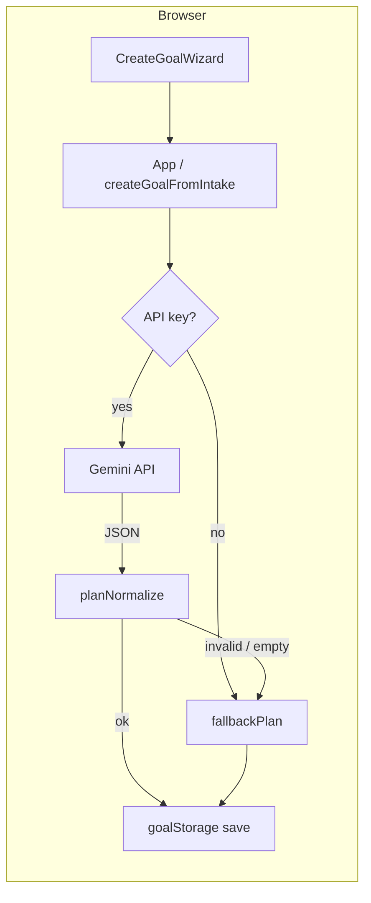

# ConstAI (`constai-app`)

**ConstAI** is a client-side web app for turning a personal goal into a **deadline-based plan**: you describe what you want, how much **free time** you have on **weekdays vs weekends**, and the app produces **milestones by calendar week**, **tasks on specific dates**, and a **day-by-day schedule** with optional **focus timers**.

Planning uses **Google Gemini** when you configure an API key; otherwise a **local template plan** keeps the app fully usable offline.

```bash
cd constai-app && npm install && npm run dev
```

---

## Table of contents

- [Overview](#overview)
- [Features](#features)
- [Requirements](#requirements)
- [Installation & local development](#installation--local-development)
- [Environment variables](#environment-variables)
- [npm scripts](#npm-scripts)
- [Using the app](#using-the-app)
- [How it works (architecture)](#how-it-works-architecture)
- [Project structure](#project-structure)
- [Data & persistence](#data--persistence)
- [Gemini integration](#gemini-integration)
- [Deploying to production](#deploying-to-production)
- [Troubleshooting](#troubleshooting)
- [Security notes](#security-notes)
- [Contributing & code quality](#contributing--code-quality)
- [Related documentation](#related-documentation)

---

## Overview

| Topic | Detail |
|--------|--------|
| **Stack** | React 19, Vite 8, Tailwind CSS 4, `@google/generative-ai` |
| **Backend** | None required; goals live in the **browser** (`localStorage`) |
| **AI** | Optional **structured JSON** from Gemini (`responseSchema` + JSON MIME type) |
| **Repo layout** | This app often lives in a subfolder **`constai-app/`** with the **git root one level above** |

---

## Features

| Area | What you get |
|------|----------------|
| **Goal wizard** | Step 1: goal **name**. Step 2: **why it matters**, **focus area**, **deadline**, **weekday** and **weekend** free minutes per day. |
| **AI plan** | With a key, **Gemini** returns cadence, **milestones aligned to planner weeks**, tasks with **`scheduledDate`**, **`tip`**, and **assigned work days**. |
| **Fallback plan** | If the key is missing, the request fails, or JSON **fails validation**, **`fallbackPlan.js`** builds a usable plan so you can still use the app. |
| **Schedule** | **Weeks from today → deadline** (local calendar). Each week shows a **milestone** and **day buttons**; **today** is highlighted. |
| **Day tasks** | Tapping a day opens a **modal** with tasks from **all goals** on that date, plus tips and **timer** actions. |
| **Progress** | Per-goal **progress bar**; finishing all tasks can trigger a **celebration** modal. |
| **Overall Plan Summary** | Cadence stats, schedule type, **work days** line, and **reasoning** text (no extra bullet list under the card). |
| **Header** | **CONST AI** branding; title varies by context (e.g. goal list vs detail vs wizard step). |
| **Demo account** | Avatar opens **login/register (demo)** — inputs are **not persisted** and **not sent** anywhere; refresh clears session. |
| **Debug panel** | On Gemini **errors** or **validation failure**, a panel can show the message and a **truncated JSON preview** (not your API key). |
| **Favicon** | `public/favicon.svg` — **blue lightning** on a dark blue tile. |

---

## Requirements

- **Node.js** (LTS recommended) and **npm**
- A modern evergreen browser
- **Optional:** [Google AI Studio](https://aistudio.google.com/) / [Gemini API](https://ai.google.dev/gemini-api/docs) key for live AI plans

---

## Installation & local development

```bash
cd constai-app
npm install
npm run dev
```

Open the URL Vite prints (usually `http://localhost:5173`).

After changing **environment variables**, stop and restart `npm run dev`.

---

## Environment variables

Create **`constai-app/.env.local`** next to `package.json`. This file is **gitignored** (see `.gitignore`: `*.local`, `*.env.local`).

| Variable | Required | Description |
|----------|----------|-------------|
| `VITE_GEMINI_API_KEY` | No* | Enables live Gemini goal plans. *Without it, the app uses the local fallback. |
| `VITE_GEMINI_MODEL` | No | Overrides default model (`gemini-2.5-flash` in `src/lib/geminiGoalPlan.js`). |

Example (do not commit real values):

```env
VITE_GEMINI_API_KEY=your_key_here
# VITE_GEMINI_MODEL=gemini-2.5-flash
```

**Vite rule:** only variables prefixed with **`VITE_`** are exposed to client code via `import.meta.env`.

---

## npm scripts

| Command | Description |
|---------|-------------|
| `npm run dev` | Start Vite dev server with HMR |
| `npm run build` | Production build to `dist/` |
| `npm run preview` | Serve the production build locally |
| `npm run lint` | Run ESLint on the project |

---

## Using the app

1. **Create a goal** — Use the wizard on the home view; **Proceed** then fill details and **Add goal**.
2. **Wait for planning** — With a key, the app calls Gemini; otherwise planning is instant from the template.
3. **Open a goal** — Click a goal card to see **Overall Plan Summary**, **Why**, **progress**, **schedule**, and per-week milestones.
4. **Work by day** — Expand a week, tap a **day**; complete tasks with the **timer** if you like.
5. **Multiple goals** — The day modal **aggregates** tasks from every goal on the selected date.
6. **Remove a goal** — Use **Remove goal** on the card or dashboard; a short reflection prompt may appear (stub analytics).

---

## How it works (architecture)

High-level flow when you submit the wizard:



- **`buildIntakeForModel`** shapes wizard data for the model.
- **`generateGoalPlanFromGemini`** sends structured generation config + user JSON payload (includes **`todayDate`**, **`plannerWeekCount`**, week date ranges).
- **`normalizeGeminiPlanWithDeadline`** / **`planNormalize.js`** validates and clamps fields, aligns **milestones** to **`buildPlannerWeeks`**, and **assigns missing task dates** via **`taskDates.js`**.
- **`createGoalFromIntake`** merges into a single **goal** object; **`App`** appends it and may open the dashboard.

---

## Project structure

When the Git repository root is the **parent** of this folder, set your deploy **root** to **`constai-app`**.

```
constai-app/
├── index.html                 # Entry HTML, favicon link
├── package.json
├── vite.config.js
├── eslint.config.js
├── public/
│   └── favicon.svg            # Blue lightning favicon
├── src/
│   ├── main.jsx               # React root
│   ├── App.jsx                # Routing: list vs dashboard; auth; timers; debug
│   ├── index.css              # Global styles (Tailwind)
│   ├── components/
│   │   ├── CreateGoalWizard.jsx
│   │   ├── GoalList.jsx / GoalCard.jsx
│   │   ├── GoalDashboard.jsx  # Plan summary, schedule, milestones in weeks
│   │   ├── DayTasksModal.jsx
│   │   ├── FocusTimerOverlay.jsx
│   │   ├── DemoAuthModal.jsx
│   │   ├── GeminiDebugPanel.jsx
│   │   ├── GoalCelebrationModal.jsx
│   │   ├── RemoveGoalDialog.jsx
│   │   ├── TaskCompletedToast.jsx
│   │   ├── ProgressBar.jsx
│   │   └── …                  # Other UI modules (some may be legacy/unwired)
│   ├── lib/
│   │   ├── geminiGoalPlan.js  # Client, schema, system instruction
│   │   ├── planNormalize.js   # Post-process model output
│   │   ├── createGoalModel.js
│   │   ├── goalStorage.js     # localStorage + migrations
│   │   ├── calendar.js        # Local-date planner weeks
│   │   ├── plannerMilestones.js
│   │   ├── taskDates.js
│   │   ├── fallbackPlan.js
│   │   ├── schedule.js
│   │   ├── demoAuthAvatar.js
│   │   └── …                  # milestones, analyticsStub, etc.
│   └── data/
├── README.md                  # This file
└── DEVELOPMENT_SESSION_SUMMARY.md
```

---

## Data & persistence

| Store | Key / mechanism | Contents |
|--------|------------------|----------|
| **Goals** | `localStorage` **`constai-goals-v2`** (`GOALS_STORAGE_KEY` in `goalStorage.js`) | Array of goals: `tasks`, `cadence`, `planMilestones`, `deadline`, minutes, etc. |
| **Demo auth** | React state only | Ephemeral “session” for UI demo |
| **Secrets** | Never in repo | Use `.env.local` locally; host env in production |

Clearing site data for your domain **removes saved goals**.

---

## Gemini integration

- **Default model:** `gemini-2.5-flash` (override with `VITE_GEMINI_MODEL`).
- **Output:** JSON matching a **response schema** (cadence, milestones, tasks with dates, tips, etc.).
- **Normalization:** Invalid or incomplete plans **reject** in `planNormalize.js` and trigger **fallback** (and possibly the **debug panel** if a key was present).
- **Quotas:** HTTP **429** / quota messages from Google are surfaced in errors; the app still creates a goal with **fallback** when normalization cannot proceed.

---

## Deploying to production

### Vercel (recommended pattern)

1. **Import** the Git repository.
2. Set **Root Directory** to **`constai-app`** if the app is not at the repository root.
3. **Framework:** **Vite**, or **Other** with **Build Command** `npm run build` and **Output Directory** `dist`.
4. Add **Environment Variables** in the Vercel project:
   - `VITE_GEMINI_API_KEY` (and optionally `VITE_GEMINI_MODEL`) for **Production** (and **Preview** if you want AI on preview URLs).
5. **Redeploy** after changing env vars (Vite bakes `VITE_*` in at **build time**).
6. **Custom domain:** **Settings → Domains**; point DNS at Vercel as instructed.

### Other static hosts

Any host that serves the **`dist/`** folder as static files works. Set the same **`VITE_*`** variables in the provider’s build environment and run `npm run build`.

---

## Troubleshooting

| Symptom | Things to check |
|---------|------------------|
| **AI works locally, not on Vercel** | Env vars set for **Production**; **redeploy** after adding them; Google key **restrictions** (allowed URLs / referrers). |
| **“Gemini request failed” / 429** | Quota, billing, or model availability on your Google project; try another model or wait. |
| **Goal created but “template plan” + debug panel** | JSON did not pass `planNormalize.js`; inspect preview in the panel (truncated). |
| **Wrong “today” or week boundaries** | Planner uses **local** calendar dates in `calendar.js`; timezone edge cases near midnight are inherent to browser local time. |
| **Empty goals after browser update** | Different origin or cleared storage; data is per-browser, per-origin. |

---

## Security notes

- **`VITE_GEMINI_API_KEY` is shipped in client bundles.** Anyone can extract it from a public deployment. Prefer **API key restrictions**, **low quotas**, and **rotation**; for strong protection, proxy Gemini through a **server** and keep the key server-side only.
- **Never commit** `.env.local` or real keys. If a key was committed, **revoke and replace** it.

---

## Contributing & code quality

```bash
npm run lint
npm run build
```

Match existing patterns in components and `lib/`; keep changes focused. See **`DEVELOPMENT_SESSION_SUMMARY.md`** for a compact architecture map.

---

## Related documentation

- **`DEVELOPMENT_SESSION_SUMMARY.md`** — Developer supplement: module map, env reminders, brief history (**no secrets**).

---

## License & naming

- **npm package name:** `constai-app` (private).
- **Product / UI name:** **CONST AI**.

No license file is included in this README by default; add one in the repository if you distribute the project.
